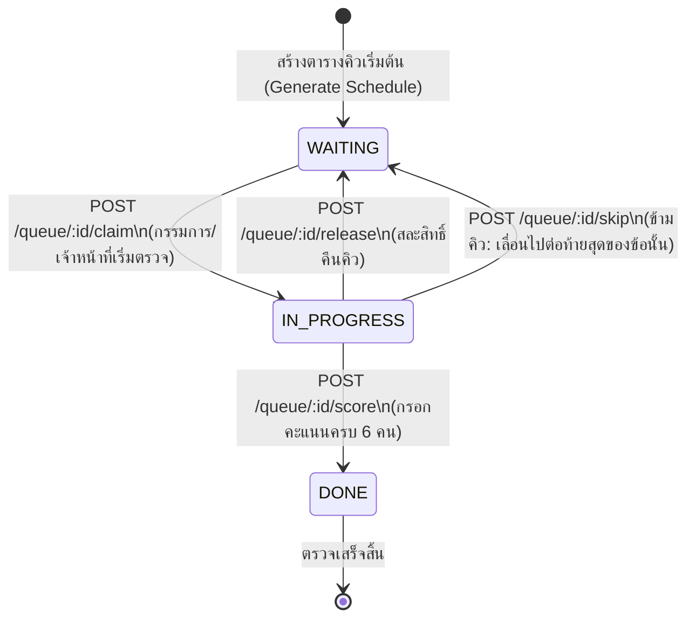
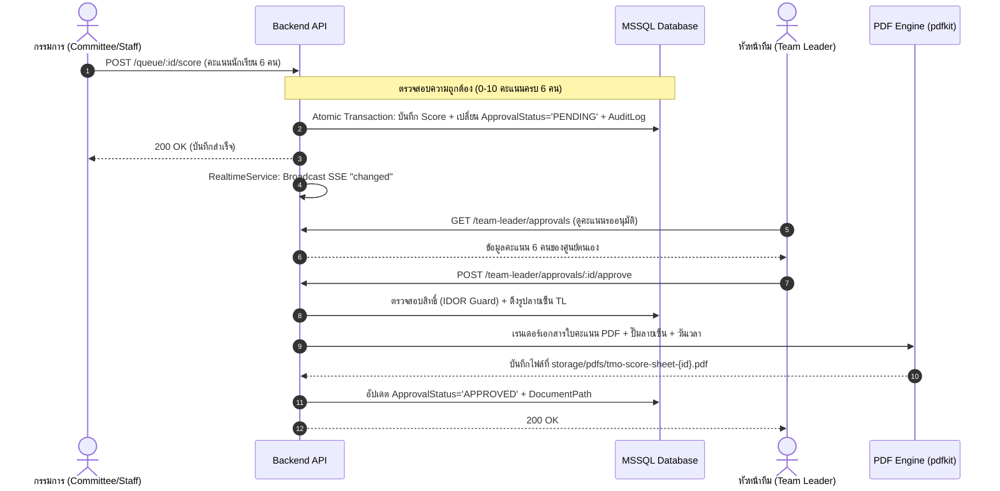
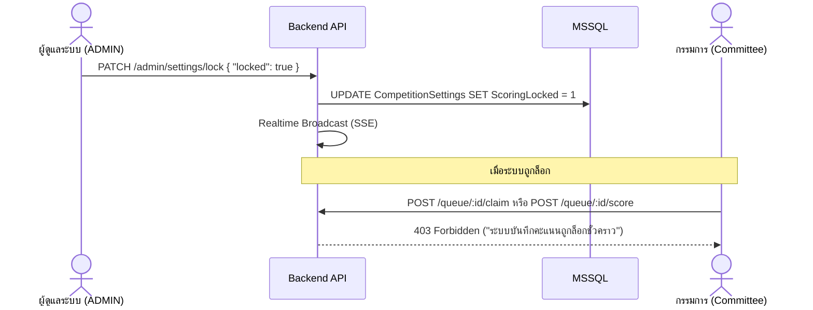

# 02 — Business Workflows & State Machines

เอกสารฉบับนี้อธิบายวงจรชีวิต (Lifecycles), สถานะของระบบ (State Machines) และขั้นตอนการทำงาน (Workflows) ทางธุรกิจทั้งหมดของระบบ **TMO Grading Queue**

---

## 1. วงจรชีวิตของคิวตรวจข้อสอบ (Queue Lifecycle)

ตารางคิว (`QueueItem`) เป็นหัวใจหลักของระบบในการจัดสรรชุดข้อสอบของแต่ละศูนย์สอบ (16 ศูนย์) ในแต่ละข้อสอบ (5 ข้อ) ให้แก่กรรมการและเจ้าหน้าที่

### 1.1 แผนภาพสถานะของคิว (Queue State Diagram)



### 1.2 การจัดการ Concurrency ในการ Claim คิว (Atomic SQL Update)

เพื่อป้องกันปัญหา Race Condition กรณีมีกรรมการ 2 คนกด Claim คิวเดียวกันในเวลาเสี้ยววินาทีเดียวกัน ระบบใช้คำสั่ง **Atomic SQL Update** ในระดับ Database Engine:

```sql
UPDATE QueueItem
SET 
    Status = 'IN_PROGRESS', 
    ClaimedByUserId = @userId, 
    ClaimedAt = SYSUTCDATETIME()
WHERE 
    Id = @id 
    AND Status = 'WAITING' 
    AND ClaimedByUserId IS NULL;
```
- หากคำสั่งนี้คืนค่า `rowsAffected === 0` ระบบจะตอบกลับด้วย `409 Conflict` ทันที ป้องกันการ Claim ซ้ำซ้อนได้อย่างสมบูรณ์

---

## 2. เวิร์กโฟลว์การตรวจและอนุมัติคะแนน (Score Submission & Approval)

เมื่อคิวเปลี่ยนสถานะเป็น `DONE` ระบบจะมีกระบวนการอนุมัติคะแนน (`ApprovalStatus`) ควบคู่กันไป

### 2.1 แผนภาพขั้นตอนการบันทึกและอนุมัติคะแนน (Scoring Workflow)



### 2.2 สถานะการอนุมัติ (`ApprovalStatus`)
1. **`NOT_SUBMITTED`**: อยู่ในระหว่างรอการตรวจหรือกำลังตรวจ
2. **`PENDING`**: กรรมการส่งคะแนนครบแล้ว รอหัวหน้าทีมตรวจสอบและลงนาม
3. **`APPROVED`**: หัวหน้าทีมลงนามอนุมัติเรียบร้อย และระบบสร้างไฟล์ PDF พร้อมลายเซ็นดิจิทัลแล้ว

---

## 3. เวิร์กโฟลว์คำขอแก้ไขคะแนน (Score Edit Request Workflow)

ในกรณีที่พบข้อผิดพลาดของคะแนนหลังการส่ง ระบบรองรับการขอแก้ไขคะแนนได้ 2 ทิศทาง:

```mermaid
flowchart TD
    A[พบข้อผิดพลาดของคะแนน] --> B{ผู้ส่งคำขอเป็นใคร?}
    
    B -->|กรรมการ / เจ้าหน้าที่| C[POST /score-edit-requests]
    C --> D[สถานะคำขอ: PENDING]
    D --> E[หัวหน้าทีม ตรวจสอบคำขอ]
    E -->|อนุมัติ (APPROVE)| F[Transaction: อัปเดตคะแนน + Re-generate PDF ใหม่ + บันทึก AuditLog]
    E -->|ปฏิเสธ (REJECT)| G[คงคะแนนเดิม + บันทึก AuditLog]
    
    B -->|หัวหน้าทีม| H[POST /score-edit-requests]
    H --> I[สถานะคำขอ: PENDING]
    I --> J[กรรมการประจำข้อนั้น ตรวจสอบคำขอ]
    J -->|อนุมัติ (APPROVE)| F
    J -->|ปฏิเสธ (REJECT)| G
```

### จุดเด่นของระบบคำขอแก้ไขคะแนน
- **Automatic PDF Regeneration**: เมื่อคำขอได้รับการอนุมัติ เอกสาร PDF ใบคะแนนฉบับเดิมจะถูกสร้างใหม่ทันทีเพื่อสะท้อนคะแนนที่ถูกต้อง พร้อมประทับตราเวลาอัปเดต
- **Two-Way Mutual Approval**: กรรมการไม่สามารถแก้คะแนนฝ่ายเดียวได้ และหัวหน้าทีมไม่สามารถแก้คะแนนฝ่ายเดียวได้ ต้องได้รับการยินยอมจากอีกฝ่ายเสมอ

---

## 4. ระบบใบคะแนน PDF และการประทับลายเซ็นดิจิทัล (PDF & E-Signature)

ระบบใบคะแนนอัตโนมัติพัฒนาด้วย `pdfkit` ออกแบบมาเพื่อให้ได้เอกสารมาตรฐานราชการ/การแข่งขันระดับชาติ:

### 4.1 องค์ประกอบของเอกสาร PDF ใบคะแนน
1. **Header**: ตราสัญลักษณ์การแข่งขัน TMO, ชื่อศูนย์สอบ, รหัสศูนย์, วันที่ และข้อสอบ (Problem 1 - 5)
2. **Score Table**: ตารางรายชื่อนักเรียนทั้ง 6 คน, รหัสนักเรียน และคะแนนที่ได้ (ทศนิยม 2 ตำแหน่ง) พร้อมคะแนนรวมเฉลี่ย
3. **Signature Section**:
   - ลายเซ็นกรรมการผู้ตรวจ (ดึงจากไฟล์ลายเซ็นที่ Admin อัปโหลดไว้)
   - ลายเซ็นหัวหน้าทีมผู้อนุมัติ (ดึงจากไฟล์ลายเซ็นที่ Admin อัปโหลดไว้)
   - Timestamp วันที่และเวลาที่ได้รับการอนุมัติ

### 4.2 การจัดการฟอนต์ภาษาไทย (Thai Typography)
- ใช้ไฟล์ฟอนต์ TrueType `NotoSansThai-Regular.ttf` จากแพ็กเกจ `@expo-google-fonts/noto-sans-thai`
- รองรับการตัดคำและแสดงผลสระ วรรณยุกต์ภาษาไทยได้อย่างถูกต้อง ไม่เกิดปัญหาสระลอยหรือวรรณยุกต์ซ้อน

---

## 5. ระบบล็อกการให้คะแนน (Competition Locking Workflow)

เพื่อความโปร่งใสในการแข่งขัน ผู้ดูแลระบบ (`ADMIN`) สามารถสั่งล็อกระบบการบันทึกคะแนนทั้งหมดได้:


