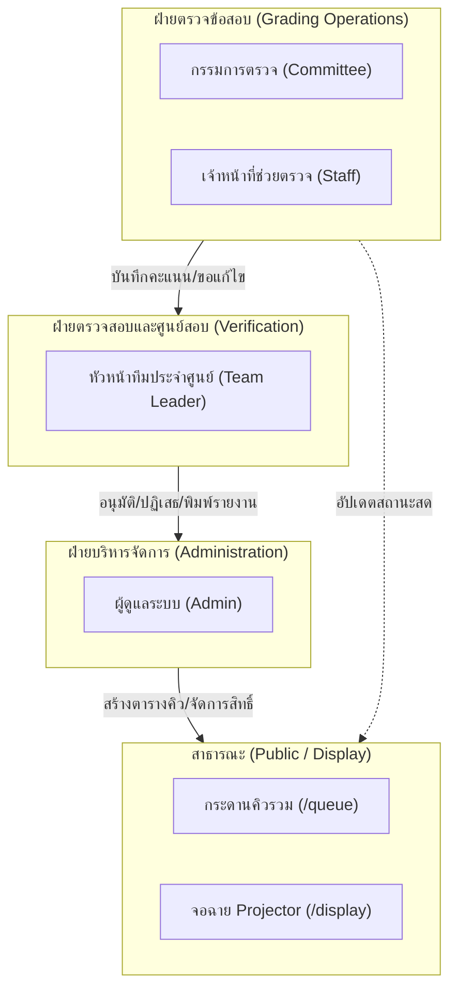

# 01. ภาพรวมระบบ (System Overview)

## 1. บทนำและที่มาของโครงการ (Background & Motivation)

การแข่งขันคณิตศาสตร์โอลิมปิกระดับชาติ (Thailand Mathematical Olympiad: **TMO**) เป็นการแข่งขันวิชาการระดับประเทศที่มีตัวแทนนักเรียนจากศูนย์ สอวน. ทั่วประเทศเข้าร่วม การตรวจข้อสอบในการแข่งขันระดับนี้มีความละเอียด ซับซ้อน และต้องเป็นไปตามมาตรฐานสูงสุด โดยมีลักษณะเฉพาะดังนี้:

- **16 ศูนย์สอบทั่วประเทศ**: แต่ละศูนย์สอบส่งทีมนักเรียนเข้าร่วมการแข่งขัน
- **ข้อสอบ 5 ข้อ**: แต่ละข้อมีความยากระดับโอลิมปิก และตรวจโดยคณะกรรมการผู้เชี่ยวชาญเฉพาะข้อ
- **การตรวจคู่ขนาน (Parallel Grading Queue)**: คณะกรรมการแต่ละข้อจะต้องตรวจข้อสอบของนักเรียนทุกคนจากทุกศูนย์หมุนเวียนกันไป
- **ความแม่นยำและความโปร่งใส (Integrity & Auditability)**: คะแนนต้องได้รับการตรวจสอบ ยืนยัน และลงนามอนุมัติจากหัวหน้าทีมประจำศูนย์ (Team Leader) ก่อนนำไปสรุปผลอย่างเป็นทางการ

**ระบบ TMO Grading Queue** ถูกออกแบบและพัฒนาขึ้นเพื่อจัดการกระบวนการตรวจข้อสอบทั้งหมดในรูปแบบดิจิทัล แทนที่กระบวนการเดิมที่ต้องใช้เอกสารกระดาษและการเดินเอกสาร ซึ่งมีความเสี่ยงต่อความล่าช้า ข้อมูลตกหล่น หรือความสับสนในการจัดลำดับคิว

---

## 2. วัตถุประสงค์ของระบบ (Objectives)

1. **จัดลำดับคิวตรวจอย่างเป็นธรรมและมีประสิทธิภาพ**: ระบบสร้างตารางการตรวจแบบ Matrix หมุนเวียนอัตโนมัติ (16 ศูนย์ x 5 ข้อ) ลดเวลารอคอย และป้องกันการตรวจชนกัน
2. **บันทึกคะแนนอย่างแม่นยำและปลอดภัย**: รองรับการลงคะแนนนักเรียนรายบุคคล (0.00 – 10.00 คะแนน) มีระบบบันทึกร่าง (Draft) ป้องกันข้อมูลสูญหาย
3. **ระบบอนุมัติคะแนนแบบสองชั้น (Two-Phase Verification)**: หัวหน้าทีม (Team Leader) ต้องตรวจสอบและลงนามอนุมัติชุดคะแนนของศูนย์ตนเองผ่านระบบดิจิทัล
4. **ความโปร่งใสแบบเรียลไทม์ (Realtime Visibility)**: มีกระดานคิวสาธารณะและหน้าจอฉาย Projector แสดงสถานะความคืบหน้าของการตรวจทั้ง 16 ศูนย์แบบสดๆ ผ่าน SSE (Server-Sent Events)
5. **การเก็บประวัติทุกการกระทำ (Audit Logging)**: บันทึกประวัติการเรียกลำดับคิว, การกรอกคะแนน, การขอแก้ไขคะแนน และการอนุมัติ ไว้อย่างครบถ้วน

---

## 3. ขอบเขตของระบบ (System Scope)

---

## 4. บทบาทและสิทธิ์ผู้ใช้งาน (User Roles & Responsibilities)

ระบบแบ่งสิทธิ์ผู้ใช้งานออกเป็น 5 กลุ่มบทบาทหลัก เพื่อความปลอดภัยและการแบ่งแยกหน้าที่ (Separation of Duties):

| บทบาท (Role) | รหัสสิทธิ์ | หน้าที่และความรับผิดชอบหลัก | หน้าจอที่เข้าถึงได้ |
|---|---|---|---|
| **ผู้ดูแลระบบ (Administrator)** | `ADMIN` | ควบคุมระบบภาพรวม, สร้างตารางคิวหมุนเวียนอัตโนมัติ, จัดการบัญชีผู้ใช้และกำหนดสิทธิ์, นำเข้ารายชื่อโรงเรียนและนักเรียน, รีเซ็ตคิว และตรวจสอบ Audit Log | `/admin/*` |
| **กรรมการตรวจข้อสอบ (Committee)** | `COMMITTEE` | รับผิดชอบการตรวจข้อสอบข้อที่ได้รับมอบหมาย, กดเรียกคิวถัดไป (Call Next), กรอกคะแนนนักเรียน 6 คน, บันทึกร่างคะแนน, ยื่นคำขอแก้ไขคะแนน | `/committee/*` |
| **เจ้าหน้าที่ช่วยตรวจ (Staff)** | `STAFF` | สนับสนุนงานตรวจข้อสอบ, ดูคิวงานที่กำลังตรวจ, ทำการข้ามคิว (Skip) หรือคืนคิว (Release) เมื่อเกิดเหตุขัดข้อง, ช่วยกรอกคะแนน | `/staff/*` |
| **หัวหน้าทีมประจำศูนย์ (Team Leader)** | `TEAM_LEADER` | ตรวจสอบคะแนนของนักเรียนในศูนย์ตนเองทั้ง 5 ข้อ, อนุมัติคะแนนพร้อมลงนามดิจิทัล, พิจารณาคำขอแก้ไขคะแนน, พิมพ์ใบรายงานคะแนนอย่างเป็นทางการ | `/team-leader/*` |
| **ผู้เข้าชมทั่วไป / จอรวม (Public / Display)** | `PUBLIC` | ติดตามสถานะคิวการตรวจของทั้ง 16 ศูนย์แบบเรียลไทม์ ไม่แสดงชื่อนักเรียนเพื่อความเป็นส่วนตัว | `/queue`, `/display`, `/login` |

---

## 5. ฟังก์ชันการทำงานหลัก (Core Features)

### 5.1 ระบบคิวหมุนเวียน 16 ศูนย์ x 5 ข้อ (Matrix Queue Scheduling)
- สร้างตารางลำดับคิวตรวจแบบ Matrix สลับคู่ศูนย์สอบและข้อสอบ เพื่อไม่ให้ศูนย์ใดต้องรอคิวนาน
- รองรับสถานะคิว 3 ระดับ: `WAITING` (รอตรวจ), `IN_PROGRESS` (กำลังตรวจ), `DONE` (ตรวจเสร็จสิ้น)
- ป้องกันการเรียกคิวซ้ำซ้อนโดยระบบ Claim Lock

### 5.2 การลงคะแนนและระบบป้องกันข้อมูลสูญหาย (Scoring & Draft Protection)
- บันทึกคะแนนนักเรียนในศูนย์ได้ 6 คนต่อชุดข้อสอบ
- บังคับทศนิยม 2 ตำแหน่ง ช่วงคะแนน `0.00 - 10.00`
- ระบบ **"บันทึกร่าง" (Auto/Manual Draft)** ลงใน `sessionStorage` ป้องกันกรณีเบราว์เซอร์ปิดตัวหรือเน็ตหลุด

### 5.3 เวิร์กโฟลว์การขอแก้ไขคะแนน (Score Edit Request Workflow)
- หากส่งคะแนนแล้วพบข้อผิดพลาด กรรมการหรือเจ้าหน้าที่สามารถส่งคำขอแก้ไขพร้อมระบุเหตุผลได้
- หัวหน้าทีมประจำศูนย์ (Team Leader) จะเป็นผู้พิจารณาอนุมัติหรือปฏิเสธคำขอแก้ไข
- มีแถบแจ้งเตือนสถานะคำขอ (Alert Bar) แจ้งเตือนแบบเรียลไทม์

### 5.4 การอนุมัติและพิมพ์รายงาน (Approval & Document Export)
- หัวหน้าทีมตรวจสอบคะแนนรวมรายบุคคลและรายข้อ
- กดอนุมัติพร้อมประทับตรารับรองดิจิทัล (Digital Stamp)
- ระบบล็อกคะแนนเมื่อได้รับการอนุมัติ และสร้างเอกสารสรุปคะแนนพร้อมพิมพ์ (Print-ready)

### 5.5 ความปลอดภัยและการควบคุม (Security & Governance)
- รหัสผ่านและ JWT Token ปลอดภัยด้วย `httpOnly` Cookie
- ตรวจสอบสิทธิ์แบบเรียลไทม์ที่ Server-side (`requireRole`)
- ลายน้ำดิจิทัล (Watermark) ระบุชื่อผู้ใช้ สิทธิ์ และเวลา ป้องกันการแคปภาพหน้าจอหลุด
