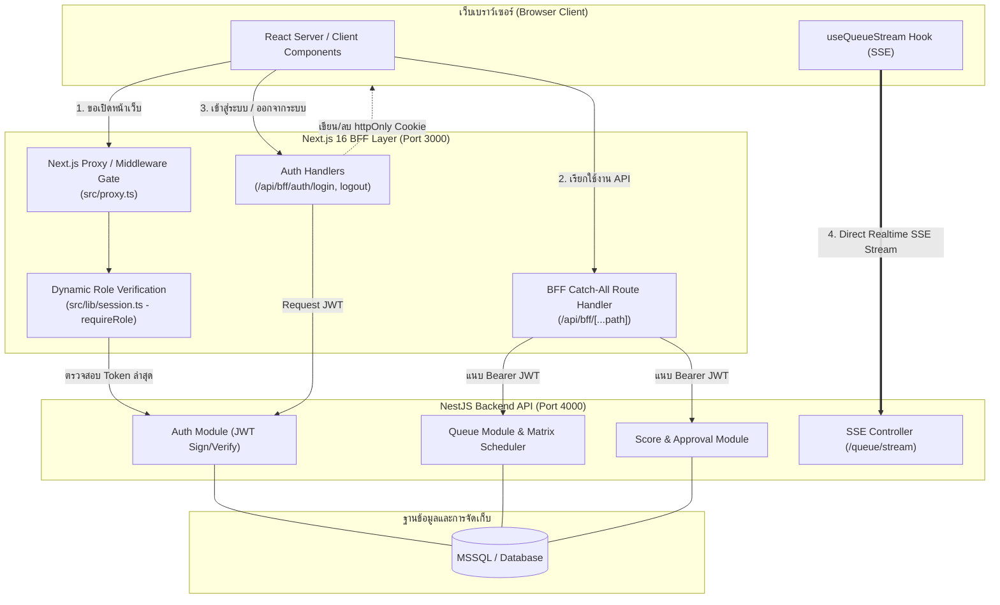
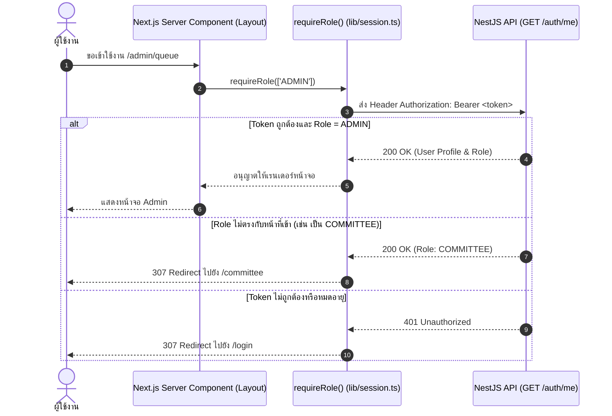
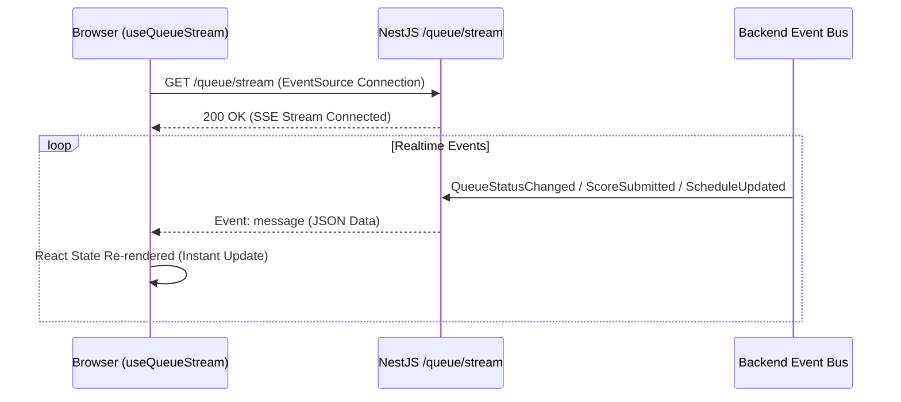

# 02. สถาปัตยกรรมระบบ (System Architecture)

## 1. ภาพรวมสถาปัตยกรรม (Architecture Overview)

ระบบส่วนหน้า (Frontend) ของ **TMO Grading Queue** พัฒนาด้วย **Next.js 16 (App Router)**, **React 19**, **TypeScript** และ **Tailwind CSS** โดยใช้รูปแบบสถาปัตยกรรม **Backend For Frontend (BFF)**

---

## 2. หลักการทำงานของรูปแบบ BFF (BFF Pattern Principles)

1. **Zero Database Access**: Frontend ไม่มีการเชื่อมต่อกับฐานข้อมูลโดยตรง และไม่มี Business Logic ที่ซับซ้อน ป้องกันความเสี่ยงจากการรั่วไหลของ Connection String หรือ Credentials
2. **Session Ownership & httpOnly Cookie**: Frontend ทำหน้าที่เก็บรักษา Token ในรูปแบบ `httpOnly` Cookie ที่ชื่อ `tmo_session` ซึ่ง JavaScript บนเบราว์เซอร์ไม่สามารถเข้าถึงได้ (ป้องกันการโจมตีแบบ XSS Token Stealing)
3. **Transparent Proxying with Token Injection**: ทุกคำขอที่ส่งไปยัง `/api/bff/*` จะถูก BFF สกัด JWT จาก Cookie และนำไปแนบใส่ใน Header `Authorization: Bearer <token>` ก่อนส่งต่อไปยัง NestJS Backend
4. **Direct SSE Stream for Realtime**: การดึงข้อมูลสตรีมคิวแบบเรียลไทม์ (`/queue/stream`) ให้ฝั่ง Client ยิงตรงเข้า NestJS ผ่าน EventSource เพื่อลดภาระของ Proxy และลด Latency

---

## 3. ระบบความปลอดภัยและ Role Guarding (Security & Guards)

### 3.1 Next.js Proxy / Middleware Gate (`src/proxy.ts`)
- ตรวจสอบความมีอยู่ของ Session Cookie (`tmo_session`)
- สำหรับหน้าที่ไม่ใช่หน้า Public หากไม่มี Cookie จะถูก Redirect ไปยังหน้า `/login` ทันที
- **หมายเหตุการออกแบบ**: ไม่ทำการตรวจสอบ Role ในชั้น Proxy นี้เพื่อป้องกันปัญหา Redirect Loop เมื่อ Admin ทำการเปลี่ยน Role ของผู้ใช้ระหว่างที่ Cookie เดิมยังไม่หมดอายุ

### 3.2 Dynamic Server-side Role Verification (`requireRole()`)
- ทุก Role Layout (`admin/layout.tsx`, `committee/layout.tsx`, `staff/layout.tsx`, `team-leader/layout.tsx`) จะเรียกใช้ `await requireRole(['ROLE_NAME'])` ใน `src/lib/session.ts`
- ฟังก์ชันนี้จะส่งคำขอไปยัง Backend `GET /auth/me` เสมอ เพื่อยืนยันว่าสิทธิ์ของผู้ใช้ในฐานข้อมูลยังถูกต้อง ณ วินาทีนั้น
- หากสิทธิ์ไม่ถูกต้อง จะถูก Redirect ไปยังหน้า Dashboard ของ Role ใหม่ของผู้ใช้ทันทีโดยอัตโนมัติ

### 3.3 ลายน้ำดิจิทัลรักษาความปลอดภัย (Watermark Security Overlay)
- คอมโพเนนต์ `Watermark.tsx` ถูกฝังอยู่ใน Layout ของเจ้าหน้าที่ทุกคน (Admin, Committee, Staff, Team Leader)
- เรนเดอร์เป็น SVG Tiled Pattern โปร่งแสงแบบไดนามิก ระบุ:
  `{Username} · {Role} · {Server Date & Time}`
- ป้องกันการบันทึกภาพหน้าจอหรือถ่ายรูปไปเผยแพร่โดยไม่ได้รับอนุญาต
- มีคำสั่ง CSS `@media print { display: none; }` เพื่อให้เวลาสั่งพิมพ์เอกสารทางการ ลายน้ำจะไม่บดบังเนื้อหา

---

## 4. ระบบการสื่อสารแบบ Realtime ด้วย SSE (Server-Sent Events)

กระดานแสดงผลคิวสาธารณะ (`/queue` และ `/display`) อัปเดตข้อมูลแบบสดๆ ตลอดเวลา โดยทำงานร่วมกับ Hook `useQueueStream`:

---

## 5. ระบบดีไซน์และโทนสี (Design System & UI Tokens)

- **ชุดสีประจำสถาบัน**: โทน Calm Crimson ผสมผสาน KMUTNB Red (`#C8102E`) และ Slate Dark/Light Palette (`#0F172A`, `#F8FAFC`)
- **การจัดการ Scroll Jank**:
  - กำหนด `overflow-x: clip` บนองค์ประกอบหลัก เพื่อให้ `position: sticky` ของแถบข้าง (AppSidebar) และแถบหัวตาราง (Table Header) ทำงานได้อย่างสมบูรณ์
  - กำหนด `scrollbar-gutter: stable` เพื่อป้องกันไม่ให้โครงสร้างหน้าจอขยับเมื่อมีแถบเลื่อนปรากฏขึ้น
