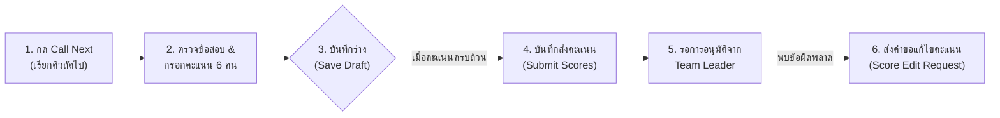

# 03. คู่มือการใช้งานระบบ (User Manual)

คู่มือนี้จัดทำขึ้นเพื่อให้ผู้ใช้งานในแต่ละบทบาทสามารถปฏิบัติงานได้อย่างถูกต้อง มีประสิทธิภาพ และเป็นไปตามขั้นตอนมาตรฐานการแข่งขัน TMO

---

## สารบัญคู่มือ
- [1. คู่มือสำหรับผู้ดูแลระบบ (Admin Manual)](#1-คู่มือสำหรับผู้ดูแลระบบ-admin-manual)
- [2. คู่มือสำหรับกรรมการตรวจข้อสอบ (Committee Manual)](#2-คู่มือสำหรับกรรมการตรวจข้อสอบ-committee-manual)
- [3. คู่มือสำหรับเจ้าหน้าที่ช่วยตรวจ (Staff Manual)](#3-คู่มือสำหรับเจ้าหน้าที่ช่วยตรวจ-staff-manual)
- [4. คู่มือสำหรับหัวหน้าทีมประจำศูนย์สอบ (Team Leader Manual)](#4-คู่มือสำหรับหัวหน้าทีมประจำศูนย์สอบ-team-leader-manual)
- [5. คู่มือสำหรับจอแสดงผลสาธารณะ (Public Board & Display Screen)](#5-คู่มือสำหรับจอแสดงผลสาธารณะ-public-board--display-screen)

---

## 1. คู่มือสำหรับผู้ดูแลระบบ (Admin Manual)

ผู้ดูแลระบบมีหน้าที่เตรียมความพร้อม จัดสรรทรัพยากร ควบคุมตารางคิว และเฝ้าระวังระบบตลอดการแข่งขัน

```
เมนูหลักของ Admin (/admin/*):
├── 📊 Dashboard ภาพรวมความคืบหน้าของทั้ง 16 ศูนย์
├── ⏱️ Queue Management: สร้างตารางคิวอัตโนมัติ / จัดการคิว / รีเซ็ตคิว
├── 👥 User & Committee: จัดการบัญชีผู้ใช้และกำหนดสิทธิ์
├── 🏫 Schools: จัดการข้อมูลศูนย์สอบ 16 ศูนย์
├── 🎓 Students: จัดการข้อมูลนักเรียนและนำเข้าไฟล์
├── 📝 Scores: ตรวจสอบคะแนนทั้งหมดในระบบ
├── 📜 Approvals: ตรวจสอบสถานะการอนุมัติและไฟล์ PDF
└── 🔍 Audit Log: ตรวจสอบประวัติการทำรายการย้อนหลัง
```

### 1.1 การสร้างตารางคิวตรวจอัตโนมัติ (Generate Schedule)
1. ไปที่เมนู **Queue Management** (`/admin/queue`)
2. เลือกวันที่และเวลากำหนดการเริ่มต้นตรวจ
3. กดปุ่ม **"สร้างตารางคิวอัตโนมัติ" (Generate Schedule)**
4. ระบบจะทำการคำนวณอัลกอริทึม Matrix หมุนเวียน 16 ศูนย์ x 5 ข้อ เพื่อไม่ให้คิวของแต่ละศูนย์และแต่ละข้อเกิดการชนกัน
5. ตรวจสอบตารางคิวที่ถูกสร้างขึ้นบนหน้าจอ

### 1.2 การจัดการผู้ใช้และสิทธิ์ (User & Role Management)
1. ไปที่เมนู **Committee & Users** (`/admin/committee`)
2. สามารถเพิ่มผู้ใช้ใหม่, แก้ไขชื่อ, เปลี่ยนรหัสผ่าน, หรือกำหนดบทบาท (`ADMIN`, `COMMITTEE`, `STAFF`, `TEAM_LEADER`)
3. สำหรับ `COMMITTEE` ให้ระบุข้อที่รับผิดชอบ (ข้อ 1 ถึง ข้อ 5)
4. สำหรับ `TEAM_LEADER` ให้เลือกระบุศูนย์สอบที่รับผิดชอบ

### 1.3 การจัดการข้อมูลนักเรียน (Student Management)
1. ไปที่เมนู **Students** (`/admin/students`)
2. ตรวจสอบรายชื่อนักเรียนแยกตามศูนย์ (แต่ละศูนย์มีนักเรียน 6 คน โดยมีลำดับที่ 1-6 และรหัสนักเรียนเฉพาะ)
3. รองรับการแก้ไขข้อมูลรายบุคคลหรือการนำเข้ารายชื่อผ่านไฟล์

### 1.4 การรีเซ็ตระบบคิวกรณีฉุกเฉิน (Emergency Queue Reset)
> [!CAUTION]
> การรีเซ็ตคิวจะทำการล้างสถานะการตรวจและคิวทั้งหมด กรุณาใช้เมื่อจำเป็นเท่านั้น

1. ในหน้า **Queue Management** เลื่อนลงไปยังส่วน **Danger Zone**
2. กดปุ่ม **"รีเซ็ตคิวทั้งหมด" (Reset All Queues)**
3. จะมีหน้าต่างยืนยันความปลอดภัยขึ้นมา ให้ผู้ดูแลระบบพิมพ์คำว่า **`RESET`** ในช่องยืนยันก่อนกดตกลง

---

## 2. คู่มือสำหรับกรรมการตรวจข้อสอบ (Committee Manual)

กรรมการมีหน้าที่รับผิดชอบในการตรวจข้อสอบข้อที่ได้รับมอบหมาย และบันทึกคะแนนของนักเรียนทุกคนลงในระบบ



### 2.1 การเรียกคิวตรวจ (Call Next Queue)
1. เข้าสู่ระบบด้วยบัญชีกรรมการ ระบบจะนำเข้าสู่หน้าโต๊ะตรวจประจำข้อ (`/committee`)
2. ระบบจะแสดงสถานะคิวปัจจุบันและคิวที่กำลังรออยู่
3. กดปุ่ม **"เรียกคิวถัดไป" (Call Next)** เพื่อดึงคิวของศูนย์สอบถัดไปเข้ามายังโต๊ะตรวจ
4. สถานะคิวของศูนย์นั้นบนกระดานรวมจะเปลี่ยนเป็น **`IN_PROGRESS`** สีเหลืองอำพันทันที

### 2.2 การกรอกคะแนนและบันทึกร่าง (Scoring & Draft)
1. บนหน้าจอจะแสดงรายชื่อนักเรียนทั้ง 6 คนของศูนย์ที่กำลังตรวจ
2. กรอกคะแนนของนักเรียนแต่ละคน (ค่าระหว่าง `0.00` ถึง `10.00` ทศนิยม 2 ตำแหน่ง)
3. **ฟังก์ชันบันทึกร่าง (Save Draft)**:
   - หากยังตรวจไม่เสร็จครบทุกคน สามารถกด **"บันทึกร่าง"** ได้ ข้อมูลจะถูกเก็บไว้ใน `sessionStorage` ของเบราว์เซอร์
   - หากเผลอปิดแท็บหรือกด Refresh ข้อมูลคะแนนที่บันทึกร่างไว้จะไม่สูญหาย
4. เมื่อตรวจครบถ้วนแล้ว ให้กดปุ่ม **"บันทึกส่งคะแนน" (Submit Scores)**
5. สถานะคิวจะเปลี่ยนเป็น **`DONE`** และส่งต่อไปยังขั้นตอนการรออนุมัติจากหัวหน้าทีม

### 2.3 การยื่นคำขอแก้ไขคะแนน (Score Edit Request)
1. หากส่งคะแนนไปแล้วและพบข้อผิดพลาดในการรวมคะแนนหรือตรวจทาน
2. ไปที่เมนู **คำขอแก้ไขคะแนน** (`/committee/score-edit-requests`)
3. เลือกศูนย์สอบและระบุคะแนนใหม่ที่ถูกต้อง พร้อมพิมพ์เหตุผลในการขอแก้ไขอย่างชัดเจน
4. กดส่งคำขอ คำขอจะถูกส่งไปยังหน้าจอของหัวหน้าทีมประจำศูนย์นั้นเพื่อรอการพิจารณา

---

## 3. คู่มือสำหรับเจ้าหน้าที่ช่วยตรวจ (Staff Manual)

เจ้าหน้าที่มีหน้าที่สนับสนุนการทำงานของกรรมการ คอยดูแลความราบรื่น และจัดการกรณีคิวสะดุด

### 3.1 การจัดการคิวงาน (Skip & Release Queue)
1. เข้าสู่ระบบในบทบาทเจ้าหน้าที่ (`/staff`)
2. **การข้ามคิว (Skip)**: หากพบว่าชุดข้อสอบของศูนย์นั้นยังมาไม่ถึงโต๊ะตรวจ หรือติดปัญหาเอกสาร สามารถกดปุ่ม **"ข้ามคิว" (Skip)** เพื่อให้ระบบข้ามไปเรียกศูนย์ถัดไปก่อนได้
3. **การคืนคิว (Release)**: หากต้องการยกเลิกการตรวจชั่วคราวและนำคิวกลับเข้าสู่สถานะรอตรวจ (`WAITING`) ให้กดปุ่ม **"คืนคิว" (Release)**

### 3.2 การช่วยบันทึกคะแนนและประสานงานคำขอแก้ไข
- เจ้าหน้าที่สามารถช่วยกรรมการกรอกคะแนนและตรวจสอบความถูกต้องก่อนส่งได้
- ตรวจสอบรายการคำขอแก้ไขคะแนนในหน้า `/staff/score-edit-requests` เพื่อติดตามสถานะ

---

## 4. คู่มือสำหรับหัวหน้าทีมประจำศูนย์สอบ (Team Leader Manual)

หัวหน้าทีมประจำศูนย์สอบทำหน้าที่เป็นด่านตรวจทานสุดท้าย (Final Verifier) เพื่อรักษาผลประโยชน์และความถูกต้องให้นักเรียนในศูนย์ของตนเอง

### 4.1 การตรวจสอบคะแนนของศูนย์ตนเอง (Dashboard & Overview)
1. เข้าสู่ระบบในบทบาทหัวหน้าทีม (`/team-leader`)
2. หน้าจอ Dashboard จะแสดงสถานะการตรวจของศูนย์ตนเองทั้ง 5 ข้อ:
   - ข้อไหนกำลังตรวจ (`IN_PROGRESS`)
   - ข้อไหนตรวจเสร็จแล้วรออนุมัติ (`PENDING APPROVAL`)
   - ข้อไหนได้รับการอนุมัติเรียบร้อยแล้ว (`APPROVED`)

### 4.2 การลงนามอนุมัติคะแนน (Approve Scores & Digital Stamp)
1. ไปที่เมนู **อนุมัติคะแนน** (`/team-leader/approvals`)
2. เลือกดูรายละเอียดคะแนนของแต่ละข้อ ตรวจสอบคะแนนของนักเรียนทั้ง 6 คน
3. เมื่อตรวจสอบแล้วว่าถูกต้อง ให้กดปุ่ม **"อนุมัติผลคะแนน" (Approve Scores)**
4. ระบบจะทำการประทับตราดิจิทัล (Digital Timestamp & Signature) บันทึกชื่อหัวหน้าทีมและเวลาที่อนุมัติ
5. เมื่ออนุมัติแล้ว ข้อมูลคะแนนข้อนั้นจะถูกล็อกทันที

### 4.3 การพิจารณาคำขอแก้ไขคะแนน (Review Edit Requests)
1. ไปที่เมนู **คำขอแก้ไขคะแนน** (`/team-leader/score-edit-requests`)
2. หากกรรมการส่งคำขอแก้ไขคะแนนเข้ามา จะปรากฏแถบแจ้งเตือนสีส้ม
3. หัวหน้าทีมตรวจสอบเหตุผลและคะแนนเดิมเทียบกับคะแนนใหม่:
   - หากเห็นชอบ: กด **"อนุมัติการแก้ไข" (Approve)** ระบบจะอัปเดตคะแนนทันที
   - หากไม่เห็นชอบ: กด **"ปฏิเสธ" (Reject)** พร้อมระบุเหตุผล

### 4.4 การพิมพ์รายงานสรุปผลคะแนน (Print Reports)
1. ไปที่เมนู **พิมพ์เอกสาร** (`/team-leader/print`)
2. ระบบจะจัดรูปแบบเอกสารสรุปคะแนนอย่างเป็นทางการ (Official Score Sheet) ที่มีลายน้ำและตราประทับ
3. กดปุ่ม **"พิมพ์รายงาน" (Print / Save as PDF)** เพื่อนำไปใช้ในกระบวนการประกาศผล

---

## 5. คู่มือสำหรับจอแสดงผลสาธารณะ (Public Board & Display Screen)

### 5.1 กระดานคิวรวมบนเว็บไซต์ (`/queue`)
- เหมาะสำหรับผู้เข้าแข่งขัน ครูผู้ควบคุมทีม และผู้สังเกตการณ์ทั่วไป เข้าดูผ่านสมาร์ตโฟนหรือแท็บเล็ต
- แสดงสถานะตารางหมุนเวียน 16 ศูนย์ x 5 ข้อ แบ่งตามช่วงเวลา 15 นาที
- มีรหัสสีระบุสถานะชัดเจน:
  - ⚪ **สีเทา/ขาว (`WAITING`)**: กำลังรอคิวตรวจ
  - 🟡 **สีเหลืองอำพัน (`IN_PROGRESS`)**: กำลังอยู่ระหว่างการตรวจ
  - 🟢 **สีเขียว (`DONE`)**: ตรวจเสร็จสิ้นแล้ว
- **การรักษาความเป็นส่วนตัว**: บนหน้านี้จะไม่แสดงชื่อหรือรหัสนักเรียน จะแสดงเฉพาะชื่อศูนย์สอบเท่านั้น

### 5.2 หน้าจอฉาย Projector ห้องโถงกลาง (`/display`)
- ออกแบบมาเฉพาะสำหรับการฉายขึ้นจอขนาดใหญ่ (Projector / TV Display) ในห้องโถงการแข่งขัน
- โครงสร้างหน้าจอแบบ High Contrast, ตัวอักษรขนาดใหญ่ มองเห็นได้ชัดเจนจากระยะไกล
- อัปเดตข้อมูลอัตโนมัติแบบ Realtime ผ่าน SSE โดยไม่ต้องกด Refresh หน้าจอ
- แนะนำให้เปิดเบราว์เซอร์และกด `F11` เพื่อเข้าสู่โหมด Fullscreen ตลอดช่วงการแข่งขัน
