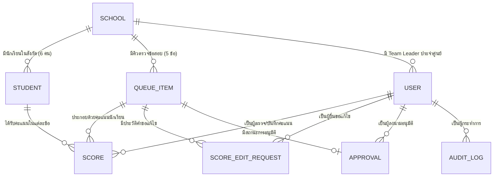

# 04. โครงสร้างข้อมูลและโมเดลความสัมพันธ์ (Data Model & Entities)

เอกสารนี้อธิบายโครงสร้างข้อมูล Entity, ชนิดข้อมูล (Data Types), สถานะการทำงาน (Enums) และความสัมพันธ์ระหว่างตารางต่างๆ ที่ใช้ในระบบ **TMO Grading Queue**

---

## 1. แผนผังความสัมพันธ์ของข้อมูล (Entity-Relationship Diagram)

---

## 2. รายละเอียด Entity และ Attributes

### 2.1 ศูนย์สอบ (School)
เก็บข้อมูลศูนย์ สอวน. / โรงเรียนศูนย์สอบทั้ง 16 แห่ง

| ฟิลด์ (Field) | ชนิดข้อมูล (Type) | ข้อจำกัด (Constraints) | คำอธิบาย |
|---|---|---|---|
| `id` | `String (UUID)` | Primary Key | รหัสประจำศูนย์สอบ |
| `code` | `String` | Unique, Nullable | รหัสย่อศูนย์สอบ เช่น `MWIT`, `TU`, `PSU` |
| `name` | `String` | Required | ชื่อเต็มของศูนย์สอบ เช่น `ศูนย์ สอวน. มหาวิทยาลัยเชียงใหม่` |
| `createdAt` | `DateTime` | Required | วันเวลาที่สร้างข้อมูล |
| `updatedAt` | `DateTime` | Required | วันเวลาที่แก้ไขล่าสุด |

---

### 2.2 นักเรียนผู้เข้าแข่งขัน (Student)
เก็บข้อมูลนักเรียนตัวแทนศูนย์สอบ (แต่ละศูนย์มี 6 คน ลำดับที่ 1-6)

| ฟิลด์ (Field) | ชนิดข้อมูล (Type) | ข้อจำกัด (Constraints) | คำอธิบาย |
|---|---|---|---|
| `id` | `String (UUID)` | Primary Key | รหัสประจำตัวนักเรียนในระบบ |
| `studentCode` | `String` | Unique, Required | รหัสประจำตัวผู้เข้าแข่งขัน (เช่น `TMO21-0101`) |
| `seqNo` | `Integer` | 1 ถึง 6, Required | ลำดับที่ของนักเรียนในทีมประจำศูนย์ (1 - 6) |
| `name` | `String` | Required | ชื่อ-นามสกุล ของนักเรียน |
| `schoolId` | `String (UUID)` | Foreign Key -> School | ศูนย์สอบที่นักเรียนสังกัด |
| `createdAt` | `DateTime` | Required | วันเวลาที่บันทึกข้อมูล |

---

### 2.3 คิวตรวจข้อสอบ (QueueItem)
ตัวแทนของคิวการตรวจ 1 ข้อ ต่อ 1 ศูนย์สอบ (รวมทั้งหมด 16 ศูนย์ x 5 ข้อ = 80 รายการคิว)

| ฟิลด์ (Field) | ชนิดข้อมูล (Type) | ข้อจำกัด (Constraints) | คำอธิบาย |
|---|---|---|---|
| `id` | `String (UUID)` | Primary Key | รหัสรายการคิว |
| `problemNumber` | `Integer` | 1 ถึง 5, Required | ข้อสอบข้อที่ตรวจ (1 - 5) |
| `schoolId` | `String (UUID)` | Foreign Key -> School | ศูนย์สอบที่เป็นเจ้าของชุดข้อสอบ |
| `status` | `QueueStatus` | Default: `WAITING` | สถานะคิว (`WAITING`, `IN_PROGRESS`, `DONE`) |
| `position` | `Integer` | Required | ลำดับการเข้าคิวตรวจ |
| `scheduledAt` | `DateTime` | Nullable | เวลาที่กำหนดให้ตรวจตามตาราง Matrix |
| `claimedByUserId`| `String (UUID)` | Foreign Key -> User, Nullable | กรรมการหรือเจ้าหน้าที่ผู้กดรับคิวนี้ไปตรวจ |
| `approvalStatus` | `ApprovalStatus` | Default: `NOT_SUBMITTED` | สถานะการอนุมัติ (`NOT_SUBMITTED`, `PENDING`, `APPROVED`) |
| `createdAt` | `DateTime` | Required | วันเวลาที่สร้างคิว |
| `updatedAt` | `DateTime` | Required | วันเวลาที่อัปเดตสถานะคิว |

---

### 2.4 คะแนนสอบ (Score)
บันทึกคะแนนของนักเรียนแต่ละคนในแต่ละข้อ (ศูนย์ละ 6 คน x 5 ข้อ = 30 บันทึกคะแนนต่อศูนย์)

| ฟิลด์ (Field) | ชนิดข้อมูล (Type) | ข้อจำกัด (Constraints) | คำอธิบาย |
|---|---|---|---|
| `id` | `String (UUID)` | Primary Key | รหัสบันทึกคะแนน |
| `studentId` | `String (UUID)` | Foreign Key -> Student | นักเรียนที่ได้รับคะแนน |
| `queueItemId` | `String (UUID)` | Foreign Key -> QueueItem | คิวตรวจข้อสอบที่เกี่ยวข้อง |
| `value` | `Decimal(4,2)` | 0.00 ถึง 10.00, Required | คะแนนที่ได้ (ทศนิยม 2 ตำแหน่ง) |
| `judgeId` | `String (UUID)` | Foreign Key -> User | ผู้ตรวจ/ผู้บันทึกคะแนน |
| `createdAt` | `DateTime` | Required | วันเวลาที่ส่งคะแนน |
| `updatedAt` | `DateTime` | Required | วันเวลาที่มีการแก้ไขคะแนน |

---

### 2.5 คำขอแก้ไขคะแนน (ScoreEditRequest)
เก็บบันทึกประวัติและเวิร์กโฟลว์เมื่อมีการขอแก้ไขคะแนนหลังส่งไปแล้ว

| ฟิลด์ (Field) | ชนิดข้อมูล (Type) | ข้อจำกัด (Constraints) | คำอธิบาย |
|---|---|---|---|
| `id` | `String (UUID)` | Primary Key | รหัสคำขอแก้ไขคะแนน |
| `queueItemId` | `String (UUID)` | Foreign Key -> QueueItem | รายการคิวที่ขอแก้ไข |
| `requestedByUserId`| `String (UUID)` | Foreign Key -> User | กรรมการหรือเจ้าหน้าที่ผู้ส่งคำขอ |
| `reason` | `String` | Required | เหตุผลในการขอแก้ไขคะแนน |
| `oldScores` | `JSON` | Required | ข้อมูลคะแนนเดิมก่อนแก้ไข |
| `proposedScores`| `JSON` | Required | ข้อมูลคะแนนใหม่ที่เสนอขอเปลี่ยน |
| `status` | `EditRequestStatus` | Default: `PENDING` | สถานะคำขอ (`PENDING`, `APPROVED`, `REJECTED`) |
| `reviewedByUserId` | `String (UUID)` | Foreign Key -> User, Nullable | Team Leader ผู้ทำการพิจารณาคำขอ |
| `reviewNote` | `String` | Nullable | บันทึกความเห็นจากผู้พิจารณา |
| `createdAt` | `DateTime` | Required | วันเวลาที่ยื่นคำขอ |
| `reviewedAt` | `DateTime` | Nullable | วันเวลาที่ทำการพิจารณา |

---

### 2.6 การลงนามอนุมัติคะแนน (Approval)
บันทึกการตรวจสอบและลงนามรับรองผลคะแนนของหัวหน้าทีมประจำศูนย์ (Team Leader)

| ฟิลด์ (Field) | ชนิดข้อมูล (Type) | ข้อจำกัด (Constraints) | คำอธิบาย |
|---|---|---|---|
| `id` | `String (UUID)` | Primary Key | รหัสบันทึกการอนุมัติ |
| `queueItemId` | `String (UUID)` | Foreign Key -> QueueItem, Unique | คิวข้อสอบที่ได้รับการอนุมัติ |
| `schoolId` | `String (UUID)` | Foreign Key -> School | ศูนย์สอบที่อนุมัติ |
| `approvedByUserId`| `String (UUID)` | Foreign Key -> User | หัวหน้าทีมผู้ลงนามอนุมัติ |
| `signatureStamp` | `String` | Required | ตราประทับดิจิทัลระบุตัวตนและเวลา |
| `pdfUrl` | `String` | Nullable | ลิงก์ไฟล์เอกสารสรุปคะแนน (PDF) |
| `createdAt` | `DateTime` | Required | วันเวลาที่ลงนามอนุมัติ |

---

### 2.7 บันทึกประวัติการใช้งาน (AuditLog)
เก็บบันทึกทุกกิจกรรมสำคัญในระบบเพื่อความโปร่งใสและตรวจสอบย้อนหลังได้ 100%

| ฟิลด์ (Field) | ชนิดข้อมูล (Type) | ข้อจำกัด (Constraints) | คำอธิบาย |
|---|---|---|---|
| `id` | `String (UUID)` | Primary Key | รหัสบันทึก Log |
| `userId` | `String (UUID)` | Foreign Key -> User, Nullable | ผู้ใช้งานที่กระทำรายการ (หรือ System) |
| `action` | `String` | Required | ประเภทการกระทำ เช่น `CALL_NEXT`, `SUBMIT_SCORE`, `APPROVE_SCORE`, `RESET_QUEUE` |
| `targetEntity` | `String` | Required | Entity ที่เกี่ยวข้อง (เช่น `QueueItem`, `Score`) |
| `targetId` | `String` | Nullable | รหัสอ้างอิงของ Entity เป้าหมาย |
| `details` | `JSON` | Nullable | รายละเอียดเพิ่มเติมของเหตุการณ์ (Before/After payload) |
| `ipAddress` | `String` | Nullable | IP Address ของ Client |
| `createdAt` | `DateTime` | Required | วันเวลาที่เกิดเหตุการณ์ |

---

## 3. รายการค่าสถานะคงที่ (Enums & Constants)

### 3.1 `QueueStatus` (สถานะคิวตรวจ)
- `WAITING`: คิวรอการเรียกตรวจ อยู่ในคิวตามลำดับ Matrix
- `IN_PROGRESS`: กรรมการกดรับคิวแล้ว กำลังตรวจข้อสอบและกรอกคะแนน
- `DONE`: ตรวจเสร็จสิ้นและส่งคะแนนเข้าระบบแล้ว

### 3.2 `ApprovalStatus` (สถานะการอนุมัติชุดคะแนน)
- `NOT_SUBMITTED`: ยังตรวจไม่เสร็จ หรือยังไม่ได้ส่งคะแนน
- `PENDING`: ส่งคะแนนแล้ว อยู่ระหว่างรอ Team Leader ตรวจสอบและลงนาม
- `APPROVED`: Team Leader ลงนามอนุมัติเรียบร้อยแล้ว คะแนนถูกล็อกถาวร

### 3.3 `EditRequestStatus` (สถานะคำขอแก้ไขคะแนน)
- `PENDING`: คำขอถูกส่งแล้ว รอ Team Leader พิจารณา
- `APPROVED`: คำขอได้รับการอนุมัติ และคะแนนถูกปรับปรุงเรียบร้อย
- `REJECTED`: คำขอถูกปฏิเสธโดย Team Leader พร้อมระบุเหตุผล

### 3.4 `UserRole` (สิทธิ์ผู้ใช้งาน)
- `ADMIN`: ผู้ดูแลระบบ
- `COMMITTEE`: กรรมการตรวจข้อสอบ (ผูกกับข้อ 1 - 5)
- `STAFF`: เจ้าหน้าที่ช่วยตรวจ
- `TEAM_LEADER`: หัวหน้าทีมประจำศูนย์ (ผูกกับ SchoolId)
